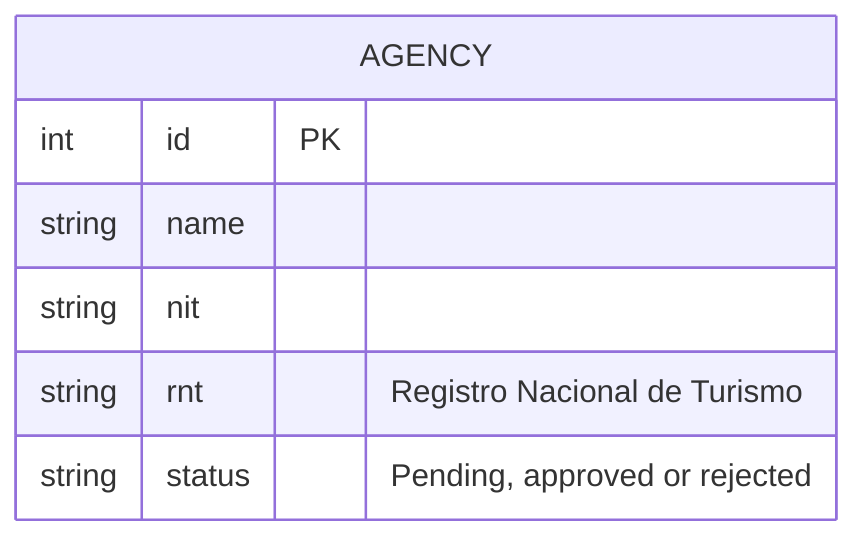

# Per-Microservice Documentation Standard

> Defines the documentation required for each microservice of Huila Travel Expedition, based on the Software Requirements Specification (SRS). This standard ensures that service documentation remains consistent with the system requirements, roles, business rules, data model, and API contracts.

---

## Required Structure for Each Service

Each microservice must live in:

```text
09-microservices/services/NN-service-name/
```

Each service MUST have:

```text
09-microservices/services/NN-service-name/
├── README.md
├── data-model.md
├── events.md
├── decisions.md
└── runbook.md
```

### Required Files

| File            | Requirement                        | Purpose                              |
| :-------------- | :--------------------------------- | :----------------------------------- |
| `README.md`     | Required from Sprint 1             | Technical description of the service |
| `data-model.md` | Required before migrations         | Data owned by the service            |
| `events.md`     | Required when events are used      | Published and consumed domain events |
| `decisions.md`  | Recommended                        | Technical decisions of the service   |
| `runbook.md`    | Required before staging deployment | Operational procedures               |

If a microservice exposes REST endpoints, its OpenAPI contract MUST be located at:

```text
07-api/contracts/openapi/service-name.yaml
```

> The SRS defines the functional modules and responsibilities of Huila Travel Expedition, but it does not establish the final number or names of microservices. Therefore, service boundaries must be validated against the architecture before implementation.

---

## README.md — Service Technical Sheet

**When to create it:** At the start of the sprint where the service is created.

**Owner:** Developer assigned to the service.

**Update when:** The service responsibility, dependencies, data ownership, API, or technical configuration changes.

### Minimum Content

The README must contain:

| Section               | What it must say                                         |
| :-------------------- | :------------------------------------------------------- |
| Responsibility        | What the service does and what data it owns              |
| Architecture location | Service location, technology, database, and dependencies |
| Responsibilities      | Concrete functions performed by the service              |
| Out of scope          | Functions delegated to other services                    |
| How to run locally    | Exact commands required to run the service               |
| API                   | Main endpoints or link to the OpenAPI contract           |
| Related documents     | Links to service documentation                           |

### Huila Travel Expedition Context

Service responsibilities must be derived from the SRS modules:

* **Administration:** agency validation, RNT verification, review moderation, general reports, and platform configuration.
* **Tourists:** search, filtering, plan details, reservations, reservation history, and reviews.
* **Agencies:** agency registration, tourist plan management, calendars, inventory, reservations, and agency reports.
* **Authentication and authorization:** secure login and role-based access for Administrator, Agency, and Tourist.

The final division into microservices must be defined in the architecture documentation.

---

## data-model.md — Service Data Model

**When to create it:** Before creating the first migration.

**Owner:** Developer assigned to the service.

**Update when:** A table, column, relationship, constraint, or data ownership rule changes.

### Minimum Content

Each service data model MUST include:

1. ER diagram using Mermaid.
2. Description of the tables or collections.
3. Columns, data types, and constraints.
4. Primary keys and foreign keys.
5. Relationships between entities.
6. Database engine justification.
7. Migration strategy.
8. Data integrity rules.

### Database Technology from the SRS

The SRS suggests:

* **MySQL 8.0** as the main database option.
* **PostgreSQL** as an alternative supported database.
* **Redis** as a cache for frequent searches.

The SRS also establishes requirements for:

* Referential integrity.
* ACID transactions.
* Protection against concurrent reservation conflicts and overbooking.
* Periodic backups.
* Recovery time objective (RTO) below 4 hours.
* Efficient response times for frequent queries.

Therefore, the selected database for each service MUST be documented and justified before implementation.

### Relevant Huila Travel Expedition Data

The SRS identifies data related to:

* Agencies.
* Users and roles.
* Tourist plans/services.
* Destinations and images.
* Tourism types.
* Calendars.
* Inventory.
* Reservations.
* Payments as a documented/future dependency.
* Reviews and ratings.
* Reports.

> The SRS does not define the final database-per-service distribution. This must be established in `06-data/models.md` and the architecture documentation.

### Field Comment Rule

A field whose purpose is not obvious MUST have a comment in the Mermaid diagram.

Example:



---

## events.md — Service Event Catalog

**When to create it:** When the service publishes or consumes its first domain event.

**Owner:** Developer assigned to the service.

**Update when:** An event is added, modified, or removed.

### Minimum Content

The document must contain:

1. Published events.
2. Consumed events.
3. Event origin.
4. Triggering action.
5. Event payload.
6. Topic or exchange when messaging infrastructure is defined.

### Events Derived from the SRS Domain

Potential domain events must correspond to important facts identified in the SRS, such as:

| Event                  | Possible Source | Description                                    |
| :--------------------- | :-------------- | :--------------------------------------------- |
| `AgencyRegistered`     | Agency service  | An agency completes its registration           |
| `AgencyApproved`       | Administration  | Administrator validates the agency and its RNT |
| `TouristPlanCreated`   | Agency          | A tourist plan is created                      |
| `TouristPlanUpdated`   | Agency          | A tourist plan is modified                     |
| `ReservationRequested` | Tourist         | A tourist requests a reservation               |
| `ReservationApproved`  | Agency          | An agency approves a reservation               |
| `ReservationCancelled` | Agency/Tourist  | A reservation is cancelled                     |
| `ReviewSubmitted`      | Tourist         | A tourist submits a rating or review           |

> These events are derived from SRS functionality. The SRS does not define a messaging broker, topics, exchanges, or an event-driven architecture, so those technical details must be decided before implementation.

The complete event structure must remain consistent with:

```text
02-domain/domain-events.md
```

---

## decisions.md — Service Technical Decisions

**When to create it:** When the team makes a non-obvious technical decision related to the service.

**Owner:** Person responsible for making the decision.

**Update when:** A new decision is made or an existing decision is replaced.

### Recommended Format

```markdown
### Decision: [short name]

**Date:** [date]

**Context:** [problem or technical situation]

**Decision:** [decision taken]

**Consequences:** [advantages, limitations and trade-offs]
```

### Example Based on the SRS

```markdown
### Decision: Relational Database for Reservation Data

**Date:** [date]

**Context:** Huila Travel Expedition requires data integrity between agencies,
tourist plans, calendars, inventory and reservations.

**Decision:** Use a relational database for transactional system data.

**Consequences:** Referential integrity and ACID transactions can be used
to reduce inconsistencies and reservation conflicts. The database requires
proper transaction and concurrency management.
```

The final database engine must be confirmed by the architecture team because the SRS allows MySQL 8.0 or PostgreSQL.

---

## runbook.md — Service Operations Manual

**When to create it:** Before the first deployment to staging.

**Owner:** Responsible developer and DevOps role.

**Update when:** An operational problem is discovered or a deployment procedure changes.

### Minimum Content

The runbook must document:

* Health check.
* Service availability verification.
* Relevant metrics.
* Common problems and solutions.
* Rollback procedure.
* Database migration procedure.
* Backup and recovery procedure.
* Configured alerts.
* Actions required when an alert is triggered.

### Huila Travel Expedition Operational Considerations

The runbook must consider the risks identified by the SRS:

| Symptom                      | Possible Cause                    | Required Action                                |
| :--------------------------- | :-------------------------------- | :--------------------------------------------- |
| Duplicate reservation        | Inventory synchronization problem | Verify calendar and inventory consistency      |
| Reservation conflict         | Concurrent reservation requests   | Verify transaction and locking behavior        |
| Incorrect agency information | Agency data not updated           | Verify agency profile and modification process |
| Agency not available         | RNT validation pending            | Check administrator validation status          |
| Slow frequent searches       | High query load                   | Verify database performance and Redis cache    |
| Lost or inconsistent data    | Database failure                  | Execute backup and recovery procedure          |

The exact commands and infrastructure must be documented after the service technology is defined.

---

## OpenAPI Contract

**When to create it:** Before implementing the first REST endpoint.

**Owner:** Developer assigned to the service.

**Update when:** An endpoint is added, modified, or removed.

### API-First Rule

The OpenAPI contract MUST be created before implementing the endpoint.

```text
OpenAPI Contract
       ↓
Implementation
       ↓
Contract Tests
       ↓
Deployment
```

The contract must be located at:

```text
07-api/contracts/openapi/service-name.yaml
```

### API Responsibilities Derived from the SRS

Depending on the final service decomposition, APIs may support functionality such as:

* Agency registration.
* Secure authentication.
* Agency profile management.
* Tourist plan creation and management.
* Search and filtering.
* Availability consultation.
* Reservation requests.
* Reservation approval or cancellation.
* Reservation history.
* Reviews and ratings.
* Administrative statistics.
* PDF report generation.
* Support/contact forms.

The final endpoints must be defined in the OpenAPI contract and traced to the corresponding functional requirements.

---

## How to Add a New Microservice

Before creating a new service:

### 1. Identify the business responsibility

The service must correspond to a clear responsibility of Huila Travel Expedition.

Examples from the SRS include:

```text
Agency management
Tourist plan management
Reservation management
Authentication and authorization
Review management
Administration and reports
```

### 2. Create the service folder

Copy:

```text
09-microservices/_template/service/
```

to:

```text
09-microservices/services/NN-service-name/
```

### 3. Update the service catalog

Add the service to:

```text
09-microservices/service-catalog.md
```

### 4. Update the dependency map

Update:

```text
09-microservices/dependency-map.md
```

if it exists.

If it does not exist, create it before documenting service dependencies.

### 5. Create the API contract

If the service exposes REST endpoints, copy:

```text
07-api/contracts/openapi/_template-service.yaml
```

to:

```text
07-api/contracts/openapi/service-name.yaml
```

### 6. Create the documentation

At minimum, create:

```text
README.md
data-model.md
```

Create `events.md` when the service begins publishing or consuming domain events.

Create `runbook.md` before the first staging deployment.

### 7. Create a Pull Request

The initial Pull Request should contain at least:

* Service `README.md`.
* Initial API contract, if applicable.
* Initial service responsibility.
* Initial data ownership.

---

## Service Scope and SRS Traceability

Every microservice must be traceable to the SRS.

The service documentation must identify the corresponding:

* User role.
* Functional requirements.
* User stories.
* Domain entities.
* Business rules.
* APIs.
* Domain events.

### Main SRS Roles

| Role          | Main Responsibilities                                                                  |
| :------------ | :------------------------------------------------------------------------------------- |
| Administrator | Verify agencies/RNT, moderate reviews, generate reports, manage platform configuration |
| Agency        | Register, manage plans/services, calendars, inventory, reservations, and own reports   |
| Tourist       | Search, compare, reserve services, consult reservations, and publish reviews           |

### Main Functional Areas

The services must support the functional requirements defined in the SRS, including:

* RF1 — Agency registration.
* RF2 — Secure authentication.
* RF3 — Contact and social information.
* RF4 — Tourist plan management.
* RF5 — Destination images.
* RF6 — Tourism type classification.
* RF7 — Search filters.
* RF8 — Differentiated rates.
* RF9 — Availability calendar.
* RF10 — Reservation requests.
* RF11 — Reservation management.
* RF12 — Confirmation emails.
* RF13 — Reservation history.
* RF14 — Ratings and reviews.
* RF15 — Administrative statistics.
* RF16 — Role-based access.
* RF17 — Featured plans.
* RF18 — PDF reports.
* RF19 — Support contact.
* RF20 — Terms and conditions.

---

## Scope Restrictions

Microservices must not introduce functionality that contradicts the SRS.

In particular, the initial project scope does **not** include:

* Online payment management.
* Financial intermediation.

The SRS mentions payment gateways such as Wompi, PayU, and MercadoPago as external dependencies/future considerations, but online payment management is excluded from the initial scope.

Future functionality documented by the SRS includes:

* Channel Manager integrations with other OTAs.
* Email marketing.
* Advanced Business Intelligence reports.
* Native mobile applications.
* Personalized recommendation engine.

These features must not be implemented as current microservice responsibilities unless the project scope is formally updated.

---

## Correlations

* General documentation rules → `00-governance/documentation-rules.md`
* Domain map → `02-domain/domain-map.md`
* Domain entities and rules → `02-domain/entities-and-rules.md`
* Domain events → `02-domain/domain-events.md`
* API contracts → `07-api/contracts/openapi/`
* Microservice templates → `09-microservices/_template/service/`
* Service catalog → `09-microservices/service-catalog.md`
* Dependency map → `09-microservices/dependency-map.md`
* Data models → `06-data/models.md`
* Operational documentation → `13-operations/`

---

## Documentation Compliance Checklist

Before merging a microservice, verify:

* [ ] The service has a clear responsibility derived from the SRS.
* [ ] `README.md` exists and is updated.
* [ ] The service's data ownership is documented.
* [ ] `data-model.md` exists before migrations.
* [ ] The database engine is justified.
* [ ] Events are documented when the service uses them.
* [ ] `decisions.md` documents non-obvious technical decisions.
* [ ] `runbook.md` exists before staging deployment.
* [ ] The OpenAPI contract exists before REST implementation.
* [ ] APIs are traceable to SRS requirements.
* [ ] Domain events are consistent with `02-domain/domain-events.md`.
* [ ] No functionality outside the current SRS scope has been introduced.
* [ ] Documentation is written in English.
* [ ] File names use `kebab-case`.
* [ ] Changes follow the project's Git and Pull Request conventions.

---

## Source of Truth

The **Huila Travel Expedition SRS** is the primary source for defining the system's business scope, user roles, functional requirements, restrictions, and documented technical dependencies.

Microservice documentation may define implementation details, but it must not contradict the approved SRS.

When a microservice decision requires functionality not defined in the SRS, the change must be reviewed and documented before implementation.
