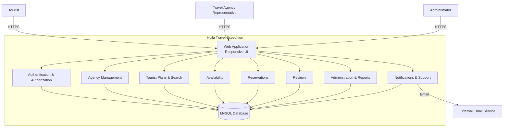

# System Architecture Overview

> **What to fill in here:** The architectural view is the technical snapshot of the system.
> It includes the C4 system and container diagram, service list, and architectural principles.
> This document is based on the Huila Travel Expedition SRS and the architectural decisions documented in this repository.

---

## 1. Adopted architectural style

**Style:** Modular Monolith + Hexagonal Architecture

**Justification:** Huila Travel Expedition is initially defined as a web platform that centralizes tourist offers from travel agencies in Huila. The SRS defines functional modules such as authentication, agency management, tourist plans, availability, reservations, reviews, administration, reports and notifications.

The SRS does not define a final microservices architecture, message broker, API Gateway or distributed database strategy. Therefore, the initial architecture is documented as a modular monolith with clear domain and application boundaries, supported by Hexagonal Architecture.

This approach allows the system to maintain separation of responsibilities while avoiding unnecessary distributed-system complexity during the initial implementation. The architecture can evolve toward microservices if future requirements justify it.

**Reference ADR:** `05-architecture/decisions/ADR-001-architectural-style.md`

> **Note:** The final ADR must be created and approved by the team before treating this architectural style as formally adopted.

---

## 2. C4 Diagram — System Level (Context)

> Shows how Huila Travel Expedition fits in the external environment. The main users are Administrator, Travel Agency Representative and Tourist.

```text
┌─────────────────────────────────────────────────────────────────────┐
│                    HUILA TRAVEL EXPEDITION                          │
│                                                                     │
│  ┌───────────────────────────────────────────────────────────────┐  │
│  │                    Web Platform                               │  │
│  │                                                               │  │
│  │ Authentication & Authorization                                │  │
│  │ Agency Management                                             │  │
│  │ Tourist Plans & Search                                        │  │
│  │ Availability & Reservations                                   │  │
│  │ Reviews                                                       │  │
│  │ Administration & Reports                                     │  │
│  │ Notifications & Support                                      │  │
│  └───────────────────────────────────────────────────────────────┘  │
│                                                                     │
└──────────────────────────────┬──────────────────────────────────────┘
                               │ HTTPS
              ┌────────────────┼────────────────┐
              │                │                │
       ┌──────▼──────┐  ┌──────▼──────┐  ┌──────▼──────────┐
       │   Tourist   │  │ Travel      │  │ Administrator   │
       │             │  │ Agency      │  │                 │
       │ Search      │  │ Manage      │  │ Verify agencies │
       │ Compare     │  │ Plans       │  │ Statistics      │
       │ Reserve     │  │ Availability│  │ Reports         │
       │ Review      │  │ Reservations│  │ Moderation      │
       └─────────────┘  └─────────────┘  └─────────────────┘

                     External Services
                            │
                 ┌──────────▼──────────┐
                 │ Email notification  │
                 │ service             │
                 └─────────────────────┘
```

> The SRS identifies confirmation emails as a functional requirement. The specific external email provider is not defined in the SRS.

---

## 3. C4 Diagram — Container Level

> Shows the main application modules and infrastructure components. Since the SRS does not define separate deployable microservices, the containers below represent logical application modules within the initial modular monolith.



### Main communication channels

| Source              | Destination            | Communication                 |
| ------------------- | ---------------------- | ----------------------------- |
| Users               | Web Application        | HTTPS                         |
| Web Application     | Application modules    | Internal application calls    |
| Application modules | MySQL Database         | Application data access       |
| Notifications       | External email service | Email                         |
| Tourist             | Tourist Plans          | HTTPS through Web Application |
| Tourist             | Reservations           | HTTPS through Web Application |
| Agency              | Agency Management      | HTTPS through Web Application |
| Administrator       | Administration         | HTTPS through Web Application |

> Exact API routes, ports, message brokers and distributed communication mechanisms are **not specified in the SRS** and therefore are not fixed in this overview.

---

## 4. Service catalog

> In the initial architecture, these are logical modules rather than independent microservices.

| # | Service / Module              | Responsibility                                               | Port          | DB    | Communication type |
| - | ----------------------------- | ------------------------------------------------------------ | ------------- | ----- | ------------------ |
| 1 | `web-application`             | User interface and access to platform functionality          | Not specified | —     | HTTPS              |
| 2 | `authentication-module`       | Registration, authentication and role-based access           | Not specified | MySQL | Internal / HTTPS   |
| 3 | `agency-module`               | Agency registration, information and tourist plan management | Not specified | MySQL | Internal / HTTPS   |
| 4 | `tourist-plans-module`        | Tourist plans, images, classification, search and filtering  | Not specified | MySQL | Internal / HTTPS   |
| 5 | `availability-module`         | Management of tourist plan availability                      | Not specified | MySQL | Internal / HTTPS   |
| 6 | `reservation-module`          | Reservation requests, approval, cancellation and history     | Not specified | MySQL | Internal / HTTPS   |
| 7 | `review-module`               | Ratings and reviews                                          | Not specified | MySQL | Internal / HTTPS   |
| 8 | `administration-module`       | Statistics, agency verification, featured plans and reports  | Not specified | MySQL | Internal / HTTPS   |
| 9 | `notification-support-module` | Reservation confirmation emails and support requests         | Not specified | MySQL | Internal / HTTPS   |

> Full service/module detail can be documented in `09-microservices/service-catalog.md` if the architecture evolves toward independently deployable services.

---

## 5. Architectural principles

These principles guide the project's technical decisions. Before making an important decision,
verify it is consistent with these principles.

### P1: API-First

When external APIs are implemented, their contracts should be documented before implementation.

OpenAPI contracts are the proposed source of truth for API consumers.

### P2: Modular Boundaries

Each functional module must have a clearly defined responsibility and must avoid unnecessary coupling with other modules.

The initial implementation uses a modular monolith, while keeping boundaries that can support future extraction into independent services.

### P3: Dependency Inversion

Business rules must not depend directly on infrastructure technologies.

The Hexagonal Architecture document defines ports and adapters so that application and domain logic remain independent from database, web and external-service implementations.

Reference:

`05-architecture/hexagonal-architecture.md`

### P4: Security by Design

Security must be considered throughout the system.

The SRS requires:

* HTTPS with a valid SSL certificate.
* Passwords must never be stored in plain text.
* Laravel native password hashing.
* Role-based access control.
* Protection of personal data according to Law 1581 of 2012.
* Audit logging and access controls.
* Temporary blocking after five failed login attempts.
* Session expiration after 30 minutes of inactivity.

### P5: Data Integrity

Reservation operations must preserve data consistency and prevent overbooking.

The SRS specifies the use of ACID transactions and locking mechanisms for reservation integrity.

### P6: Performance and Scalability

The architecture must support the performance and capacity requirements defined in the SRS:

* 95% of queries below 3 seconds.
* 30–50 simultaneous users without degradation.
* Up to 500 concurrent users during peak traffic.
* Reservation processing below 3 seconds.
* Ability to scale without performance degradation.

---

## 6. Adopted architectural patterns

| Pattern                | Adopted       | Reference                                                  |
| ---------------------- | ------------- | ---------------------------------------------------------- |
| Modular Monolith       | Yes           | `05-architecture/decisions/ADR-001-architectural-style.md` |
| Hexagonal Architecture | Yes           | `05-architecture/hexagonal-architecture.md`                |
| API Gateway            | Not specified | —                                                          |
| Database per Service   | No            | Not applicable to initial modular monolith                 |
| CQRS                   | No            | Not specified in SRS                                       |
| Event Sourcing         | No            | Not specified in SRS                                       |
| Circuit Breaker        | Not specified | —                                                          |
| Saga                   | No            | Not specified in SRS                                       |
| Outbox Pattern         | Not specified | —                                                          |
| ACID Transactions      | Yes           | Huila Travel Expedition SRS                                |
| Database Locking       | Yes           | Huila Travel Expedition SRS                                |

> Patterns such as API Gateway, Circuit Breaker, Saga and Outbox must not be considered adopted until they are supported by an approved ADR.

---

## 7. Cross-cutting concerns

Transversal concerns that apply to the system and its modules:

| Concern                        | Adopted solution                                         | Where it is configured             |
| ------------------------------ | -------------------------------------------------------- | ---------------------------------- |
| Authentication / Authorization | Secure authentication and role-based access              | `00-governance/security-policy.md` |
| Password Security              | Laravel native hashing; never store plain-text passwords | SRS / Security Policy              |
| Transport Security             | HTTPS + valid SSL certificate                            | SRS / Security Policy              |
| Personal Data Protection       | Compliance with Law 1581 of 2012                         | SRS / Security Policy              |
| Session Security               | 30-minute inactivity expiration                          | SRS                                |
| Failed Login Protection        | Block after 5 failed attempts for 15 minutes             | SRS                                |
| Data Integrity                 | ACID transactions and locking for reservations           | SRS                                |
| Error Validation               | Real-time form validation                                | SRS                                |
| Responsive Design              | Mobile-first, minimum 320px                              | SRS                                |
| Browser Compatibility          | Latest two versions of Chrome, Firefox, Safari and Edge  | SRS                                |
| Backups                        | Weekly database and system backups in separate storage   | SRS                                |
| Availability                   | 99% monthly availability target                          | SRS                                |
| Image Optimization             | Images limited to 500 KB with compression                | SRS                                |
| Audit Logging                  | Audit logging for security operations                    | SRS                                |

> Specific technologies such as Prometheus, Jaeger, OpenTelemetry, Kong, NGINX, Resilience4j or Opossum are **not established by the SRS** and are therefore not adopted in this document.

---

## 8. Registered architectural technical debt

| ID     | Description                                                                            | Impact | Priority | Target sprint |
| ------ | -------------------------------------------------------------------------------------- | ------ | -------- | ------------- |
| AT-001 | Final API architecture and API contract strategy are not yet defined.                  | Medium | P2       | Future        |
| AT-002 | The final deployment architecture and service extraction strategy are not yet defined. | Medium | P2       | Future        |
| AT-003 | Monitoring and observability tools are not specified in the SRS.                       | Medium | P2       | Future        |
| AT-004 | The external email provider for reservation confirmations is not defined.              | Medium | P2       | Future        |
| AT-005 | The final migration strategy from shared hosting to VPS requires technical definition. | Medium | P2       | Future        |

> See also: `15-project-control/technical-backlog.md`

---

## 9. Planned evolution

| Version | Architectural change                                     | Motivation                                                   | Estimated date         |
| ------- | -------------------------------------------------------- | ------------------------------------------------------------ | ---------------------- |
| v1.0    | Implement modular monolith with Hexagonal Architecture   | Establish clear responsibilities and maintainable boundaries | Not specified          |
| v1.x    | Define API contracts and deployment architecture         | Improve integration and deployment consistency               | Not specified          |
| v2.0    | Evaluate extraction of independent services if justified | Support future scalability and independent deployment        | Not specified          |
| v2.x    | Evaluate external payment integration                    | Payment functionality is outside the initial scope           | Future / not specified |

> The SRS explicitly excludes online payment management and financial intermediation from the initial scope. Any payment architecture is therefore considered future evolution.

---

## Key correlations

* Domain bounded contexts → `02-domain/domain-map.md`
* Requirements → `04-requirements/`
* Specific decision ADRs → `05-architecture/decisions/`
* Hexagonal architecture → `05-architecture/hexagonal-architecture.md`
* Applied patterns → `05-architecture/pattern-guide.md`
* Per-service/module detail → `09-microservices/service-catalog.md`
* UML diagrams → `08-uml/`
* API contracts → `07-api/contracts/openapi/`
* Security rules → `00-governance/security-policy.md`
* Technical debt → `15-project-control/technical-backlog.md`

---

## Source of Truth

The **Huila Travel Expedition SRS** is the primary source for functional, non-functional and technical requirements.

Architectural decisions that are not explicitly defined in the SRS must be documented and approved through ADRs before being considered formally adopted.

The initial architecture is documented as a **Modular Monolith + Hexagonal Architecture**. Future migration toward microservices remains an architectural option and must be supported by a corresponding ADR and technical justification.
